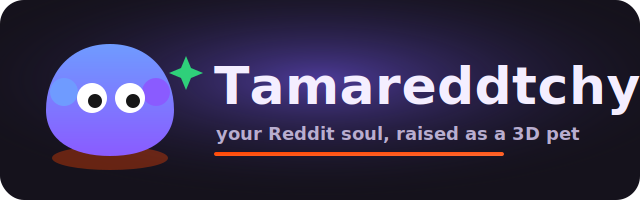
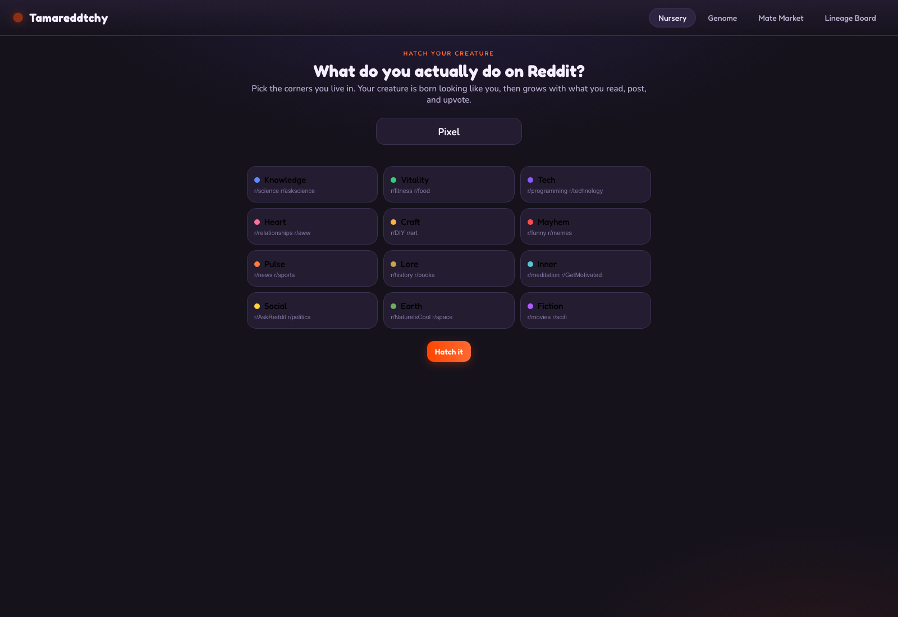
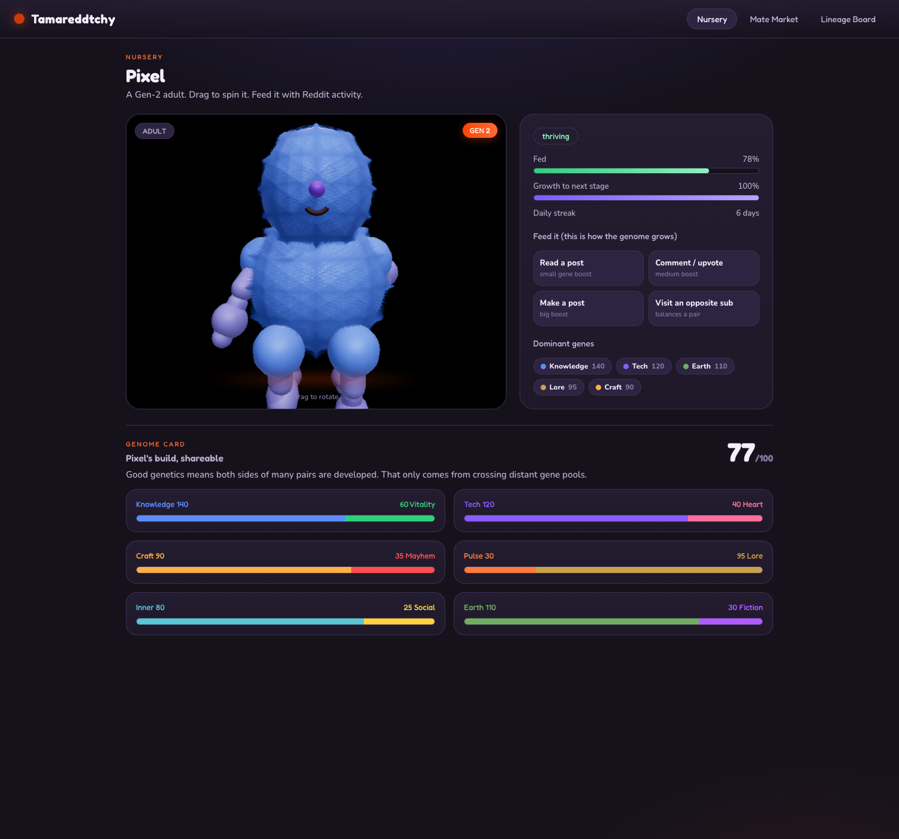
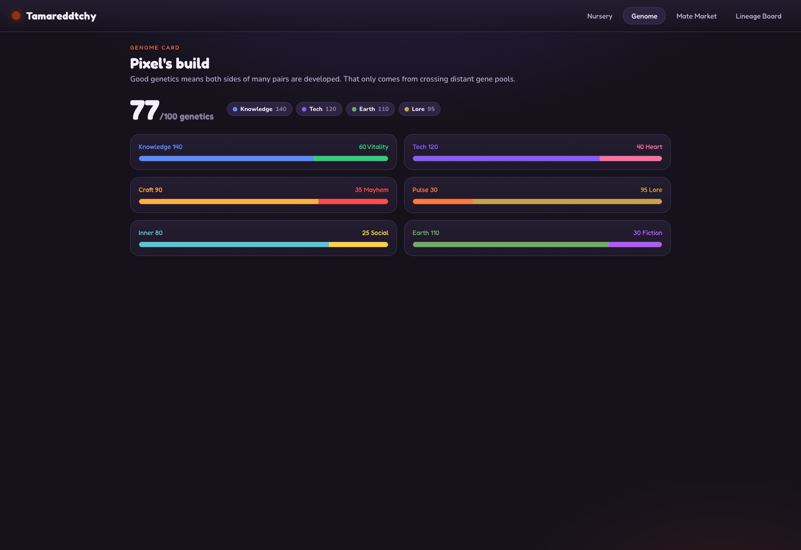
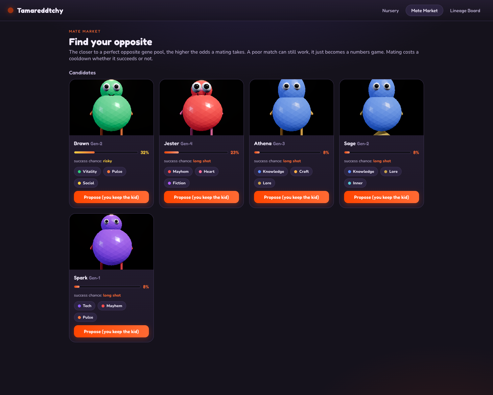
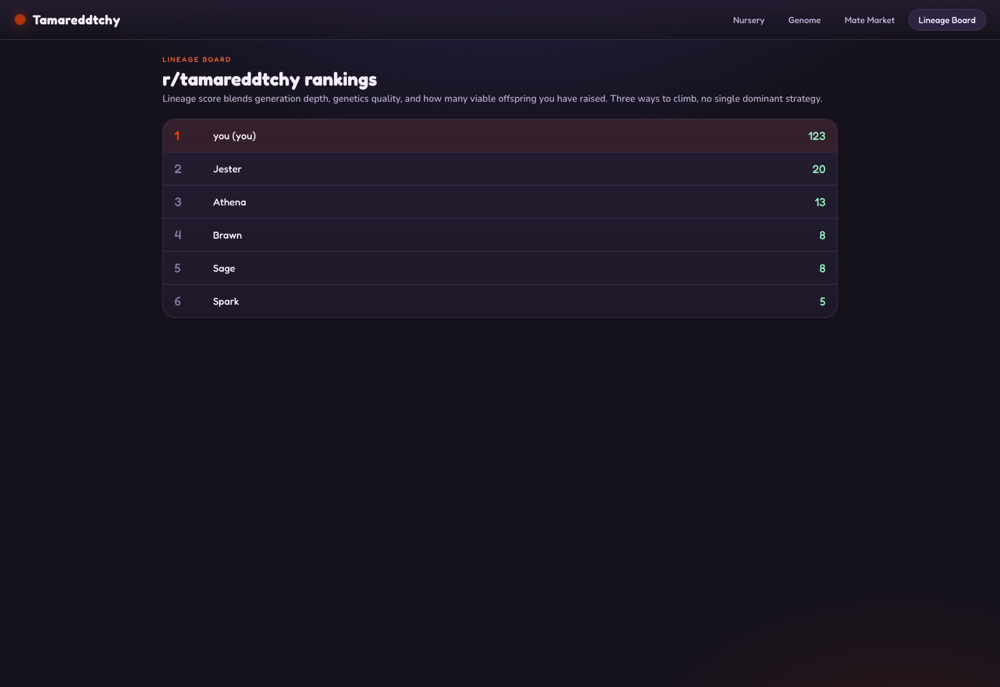

<p align="center">
  
</p>

<p align="center">
  <b>A virtual pet whose body is a living 3D readout of your Reddit personality.</b><br/>
  Built for <a href="https://redditgameswithahook.devpost.com/">Reddit's Games with a Hook</a> on Devvit Web.
</p>

<p align="center">
  <a href="https://youtu.be/YOUTUBE_ID"></a>
</p>

<p align="center"><i>(Replace YOUTUBE_ID with the demo video once it is recorded.)</i></p>

---

## Project description

Tamareddtchy is a Tamagotchi for your Reddit identity. You hatch a small creature, and from that moment its body is a pure function of what you do on Reddit. Read science, post in r/fitness, upvote in r/funny, and the creature grows a domed brain-head, athletic legs, a lumpier chaotic torso. The creature is never stored as a picture. It is rebuilt in 3D, every frame, from twelve numbers.

The hook is genetics. In biology, good genetics come from crossing distant gene pools, so the only way to raise a champion creature is to find a redditor whose interests are the opposite of yours and mate your creatures together. The subreddit becomes a dating market for opposites. Mate a Knowledge creature with a Vitality creature and you get a strong, well developed child. Mate two creatures that look alike and you get a hilarious, busted, inbred mess that everyone screenshots.

It is a game about leaving your bubble, dressed up as a pet you cannot stop checking on.

### The problem it solves

Reddit games that spike on day one and die on day three all share one flaw: nothing pulls you back, and nothing connects you to anyone else. Tamareddtchy is built backwards from the return visit.

| Without Tamareddtchy | With Tamareddtchy |
|---|---|
| You lurk your usual subs and never leave them | Your best move is to find your opposite and team up |
| A game post is played once and scrolled past | Your creature posts itself every time it grows, hatches, or breeds |
| "Engagement" is an abstract number | Engagement is literally the food that shapes a creature you are attached to |
| Winning is a high score nobody remembers | Winning is a visible, mutated, multi generation lineage you built with other people |

### The four scoring hooks, on purpose

- **Hook:** a creature that droops when you ignore it and a daily streak you do not want to break.
- **Retention:** hunger decays in real time, generations take days of nurture to climb, and a mate request only resolves when you come back.
- **User contributions:** the entire artifact is user generated. Every hatch, evolution, and birth renders an image and posts itself to the subreddit.
- **Reddit-y:** the game mechanic is upvoting, commenting, and cross community rivalry. Install it in two rival subs and their creatures carry opposite house genes, so the best offspring come from cross subreddit mating.

## Screenshots

### Hatch: tell it who you are

You start by picking the corners of Reddit you actually live in. The creature is born looking like you, then changes with everything you do next.



### The nursery: a living 3D pet

Your creature breathes, blinks, bobs, and droops when neglected. Drag to spin it. Every feed (read a post, leave a comment, make a post) pushes points into a gene and visibly reshapes the body. Note the stage, the generation badge, the needs, and the dominant genes, all derived from the genome.



### Genome card: your build, shareable

The "what's your build" card. A single genetics score out of 100 and the six opposite pairs laid out as tug of war bars. Good genetics means both sides of many pairs are developed, which you can only reach by crossing gene pools.



### Mate market: find your opposite

Every other creature in the subreddit, ranked by how complementary it is to yours and each one rendered live in 3D from its own genome. Strong matches make healthy children. Mating is a deal: you propose who keeps the single offspring and what you trade for it.



### Lineage board: three ways to win

The leaderboard ranks players by lineage score, which blends generation depth, genetics quality, and how many viable offspring you have raised. No single strategy dominates.



## Components and tech used

| Component | Role | Where it lives |
|---|---|---|
| Genome model | The 12 genes, 6 opposite pairs, genetics scoring, breeding, lineage score | [src/shared/genome.ts](src/shared/genome.ts), [src/shared/creature.ts](src/shared/creature.ts) |
| Procedural 3D render | Grows the creature geometry from the genome, no model files | [src/client/render.ts](src/client/render.ts) |
| Living scene | Three.js scene, lights, turntable, idle animation, mood reactions | [src/client/scene.ts](src/client/scene.ts) |
| Client UI | Four screens plus onboarding, the distinctive incubator-toy design | [src/client/main.ts](src/client/main.ts), [src/client/style.css](src/client/style.css) |
| Client API + mock | Talks to the server on Reddit, falls back to an in-memory world standalone | [src/client/api.ts](src/client/api.ts) |
| Devvit server | Redis-backed endpoints, mating deals, milestone posts, the menu action | [src/server/index.ts](src/server/index.ts) |
| App config | Devvit Web app definition (post, server, menu, permissions) | [devvit.json](devvit.json) |
| Tests | Game-balance and render-structure unit tests, no browser or network | [src/shared/genome.test.ts](src/shared/genome.test.ts), [src/client/render.test.ts](src/client/render.test.ts) |
| Design spec | The full design, including the mating economy | [docs/superpowers/specs/2026-06-22-tamareddtchy-design.md](docs/superpowers/specs/2026-06-22-tamareddtchy-design.md) |

**Built with:** TypeScript, Three.js, Vite, Vitest, Devvit Web (`@devvit/web`), Express, Redis, the Reddit API.

## App type declaration

Tamareddtchy is a **Devvit Web app**, published as a single **Interactive Post** that runs inside a subreddit. It is not a Devvit Blocks app and it is not an external website.

- **Client:** a web view (HTML, CSS, TypeScript, Three.js) built by Vite into `webroot/` and served as the post body.
- **Server:** Devvit server endpoints (`@devvit/web/server`) over Redis and the Reddit API, defined in `devvit.json` and implemented in `src/server/index.ts`.
- **Interactive Post:** created by a moderator menu action ("Create a Tamareddtchy nursery"), which is the live post judges play.

All game logic lives in `src/shared` and is imported by both the client and the server, so the rules can never drift between them. That same shared code is what the unit tests exercise.

## Setup instructions

### Prerequisites

- Node.js 22+ and npm
- A modern browser (the 3D needs WebGL)
- For publishing to Reddit only: a Reddit account and the Devvit CLI (`npm install -g devvit`, then `devvit login`)

### Run it standalone (no Reddit account needed)

The app ships with an in-memory world so you can play every screen locally without logging in to Reddit. This is the fastest way for a judge to see it.

```bash
git clone https://github.com/tdries/tamareddtchy.git
cd tamareddtchy
npm install
npm run dev
```

Then open the printed URL (default http://localhost:5173). To land directly in a populated game with a grown creature and rivals, open:

```
http://localhost:5173/?demo=1
```

### Run the tests

```bash
npm test
```

This runs the game-balance and render-structure suites in plain Node. No browser, no network, no Reddit.

### Build the web view

```bash
npm run build
```

Outputs the production client into `webroot/`, which is what Devvit serves as the post.

### Publish to Reddit (the live Interactive Post)

```bash
devvit login          # one time, authenticates your Reddit account
devvit upload         # uploads the app (pulls @devvit/web, builds client + server)
devvit playtest r/yourTestSub
```

Then, in your test subreddit, use the moderator menu item **"Create a Tamareddtchy nursery"** to create the interactive post. That post is the playable game.

## Repository layout

```
src/
  shared/      pure game logic (genome, creature, scoring) + tests
  client/      Three.js render, scene, UI, client API + mock
  server/      Devvit Web server endpoints
docs/
  logo.svg
  screenshots/
  superpowers/ design spec + build plan
devvit.json    Devvit Web app definition
```

## A note on data honesty

Reddit does not hand a Devvit app a user's full cross Reddit browsing history, and we do not pretend it does. The genome grows from two real, demoable sources: the activity you do inside the app (read, comment, post), and a self declared "diet" you pick at onboarding so the creature looks like you from minute one. Both are honest and sufficient. If Reddit ever exposes richer per user signals, they slot in as a third food source without changing the genome.
